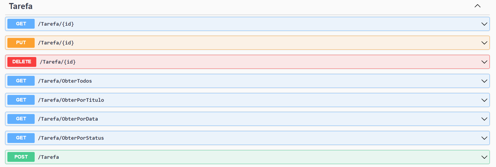

# DIO - Trilha .NET - API e Entity Framework

## Desafio de projeto
Para este desafio, usei meus conhecimentos adquiridos no módulo de API e Entity Framework, da trilha .NET da DIO.

## Contexto
Construi um sistema gerenciador de tarefas, onde cadastro uma lista de tarefas que permitirá organizar melhor a rotina.

Essa lista de tarefas tem um CRUD. 

Minha classe principal, a classe de tarefa, são as seguintes:


Gerei uma migration para atualização no banco de dados.

## Métodos
Métodos:


**Swagger**





**Endpoints**


| Verbo  | Endpoint                | Parâmetro | Body          |
|--------|-------------------------|-----------|---------------|
| GET    | /Tarefa/{id}            | id        | N/A           |
| PUT    | /Tarefa/{id}            | id        | Schema Tarefa |
| DELETE | /Tarefa/{id}            | id        | N/A           |
| GET    | /Tarefa/ObterTodos      | N/A       | N/A           |
| GET    | /Tarefa/ObterPorTitulo  | titulo    | N/A           |
| GET    | /Tarefa/ObterPorData    | data      | N/A           |
| GET    | /Tarefa/ObterPorStatus  | status    | N/A           |
| POST   | /Tarefa                 | N/A       | Schema Tarefa |

Esse é o schema (model) de Tarefa, utilizado para passar para os métodos que exigirem

```json
{
  "id": 0,
  "titulo": "string",
  "descricao": "string",
  "data": "2022-06-08T01:31:07.056Z",
  "status": "Pendente"
}
```
